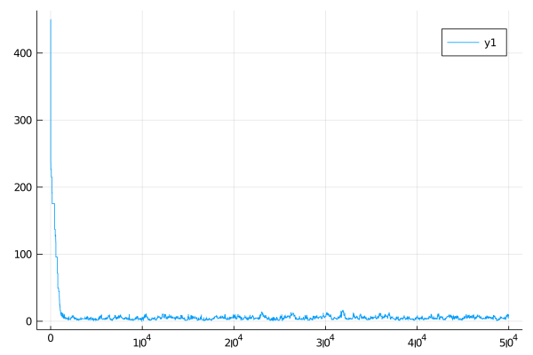
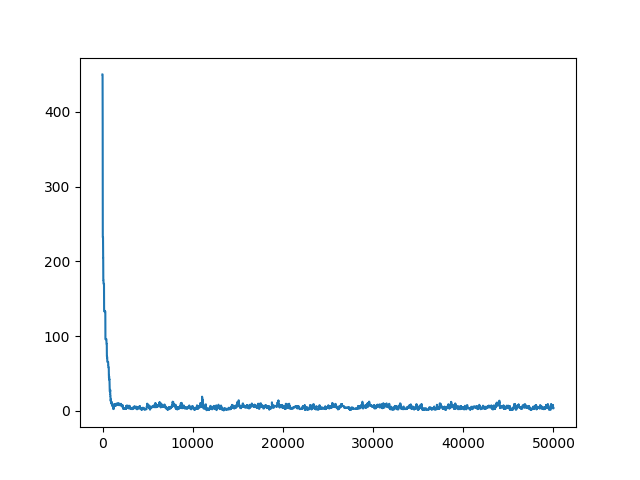
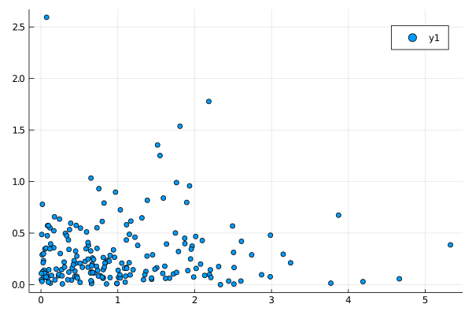
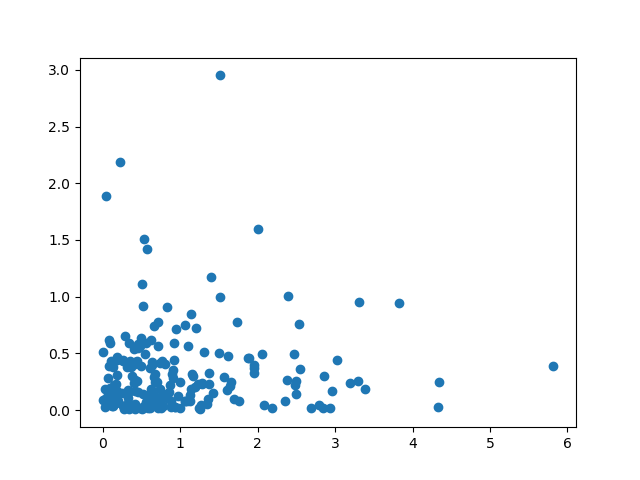
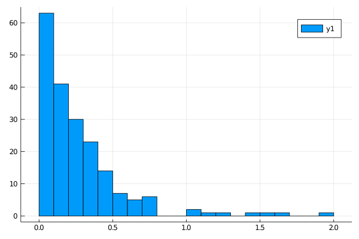
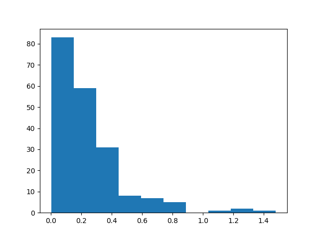

# JTwalk: Julia T-Walk package

This is the **Julia** implementation of the T-Walk algorithm *(Christen and Fox 2010)*. The **Julia** implementation was written by Nicolás Kuschinski, with special thanks to José Zubieta for his help with profiling and optimization.

The package is almost a direct translation of the essential features of **pytwalk** (the **Python** implementation of the Twalk), but it omits anything beyond the core functionality.

Some optimization was done to improve performance in Julia. See the comments **in src/TWalk.jl** for details.

## Installation

Simply use the standard Julia installation procedure:

From within Julia run:
    
    ```
    using Pkg
    Pkg.add(Packagespec(url="https://github.com/tuerda/JTwalk"))
    ```
    
## Use and examples

This package attempts to closely imitate the interface for the **Python T-Walk** package. It exports a mutable structure, called **TWalk** and a function **jtwalk** to initialize it. It also exports functions **Run!**, which performs a full run, and onemove, which is used to obtain a single move of the twalk. 

When using **Run!** two output chains are stored into the **Output** and **Output\_u** properties of the T-Walk structure. These chains are both valid MCMC samples but they are not independent from one another *(see Christen and Fox 2010)*.

This package ships with the file **twalkexample.jl**, which shows the syntax and usage. **twalkexample.jl** shows examples using the **Plots.jl** plotting library but the package is not linked to this library and other plotting libraries can be used.

## Performance

Performance of the T-Walk is closely related to the evaluation of the energy function. In general, it is expected, in most circumstances, that the Julia version of T-Walk should be significantly faster than the **Python** version when working on the the same objective functions with similar coding. Figures 1, 2 and 3 were produced with **PyTwalk** using **matplotlib** and **JTwalk** using **Plots.jl**.

For simulating the distribution as it is written in the **twalkexample.jl** file, in Julia, the **Run!** operation was timed at 0.091 seconds. For Python, using the same target distribution as it is coded in the example file for the pytwalk package, the same operation took 1.798 seconds. This situation is somewhat optimal for python because the energy function is evaluated by the numpy library and does not involve any python loops, but the Julia twalk is still faster by a factor of nearly 20. Timing in both situations has been performed using a laptop with an Intel Core i5-8265U processor (3.9GHz), running Linux 5.3.0-51-generic, and standard timing procedures for Python and Julia, respectively (The @time macro for Julia and the Cprofile profiling library for Python). This is not an official test, but it is strong evidence to favor the Julia version in terms of performance.

The following figures were generated using **twalkexample.jl** for julia and pytwalktutorial.py for Python. The figures are offered as evidence that the Julia and Python implementations simulated from the same distribution (small differences between results can be attributed to the random nature of MCMC chains).

|Julia                                                                    |Python                                                                     |
|--                                                                       |--                                                                         |
|                               |                               |
|  |  |
|                  |                  |

## Differences between Julia and Python implementations

Differences between jtwalk and Pytwalk version

The jtwalk does not:

1. perform output analysis

2. estimate the remaining time

3. include specialized plotting functions (see example.jl for how plotting can be done easily using the plots.jl library)

## Contact

For question regarding the Twalk please see Christen and Fox (2010) and visit https://www.cimat.mx/~jac/twalk/

For question regarding this implementation email me at nicolas.kuschinski@mat.uc.cl

## Bibliography

Christen, J. A. and Fox, C. (2010). “A general purpose sampling algorithm for continuous distributions (the t-walk).”Bayesian Analisis, 4(2): 263–282.
